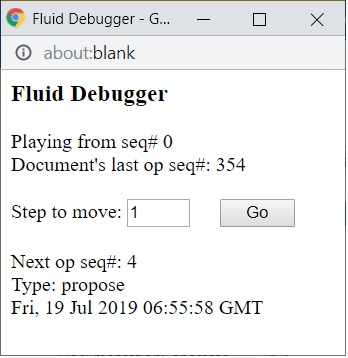

# Fluid-Debugger #

Fluid Debugger is useful tool to replay file history. This can be useful as learning tool, as well as tool to investigate corruption or performance issues. It provides read-only document and ability to start with a particular snapshot (or no snapshot at all), and play ops one by one, or in big batches.

Fluid Debugger works as an adapter on top of any document storage. In other words, it can be integrated into any app using any storage endpoint (like SPO or Routerlicious) with minimal changes to application and can be used to replay history with full app code running, thus helping investigating bugs in any layer of application stack 

## How to Enable it ##

In order to use it, these changes are required:

1. Wrap existing storage: 
    * If you have IDocumentService object, wrap it with __FluidDebugger.createFromService()__ call (note that it's async call) 
    * Or, If you have IDocumentServiceFactory, wrap it with __FluidDebugger.createFromServiceFactory()__ call
2. In Dev Tools console, do 
    > __localStorage.FluidDebugger = 1__
3. Once you refresh page, look for blocked (by browser) pop-up window notification. Enable pop-ups for your app. 

## How to disable it ##
1. In Dev Tools console, run
    > __delete localStorage.FluidDebugger__

## How it works ##

### Selecting where to start ###

Once debugger starts, you have the following choices on first screen: 

1. Close window. Debugger will be disabled and normal document flow would proceed - document is read/write. In all other options document is read-only, i.e. no local changes are committed to storage. 

2. Start with no snapshot, i.e. use only ops to play history of the file from start 

3. Use a particular snapshot to start with (use dropdown). You will see a selection of snapshots (with cryptic names) as well as starting sequence number for each of them in dropdown, sorted (with latest at the top). Please note that dropdown is populated asynchronously - there is progress text on the page noting that. 

4. Use snapshot stored on disk (snapshot.json), produced by replay tool. This option is useful if you want to validate that generation and loading of snapshot (from set of ops) does not introduce a bug. This is useful, given there is no other way to generate snapshot at particular point in time in the past. Notes:  

Currently you can't play ops on top of snapshot in this mode (though this is feature that can be added later). 
You can load snapshot from a different file (given above). As long as it's for same application, it does not matter if same file or storage endpoint is used to start an app. 

### Playing ops ###

If you chose storage snapshot (not snapshot from file) or no snapshot, you are presented with a screen that allows you to play ops (on top of snapshot). You can chose any number of ops to play at once and click "Go" button: 

Please note that playback is asynchronous, so even though Debugger UI might have acknowledged that ops where played out (and you can select next batch), application might be still in the process of processing previous batch. 

## Internals, or useful piece to use in other workflows ##

__IDebuggerController__ is an interface that controls replay logic, but not UI. An implementation of this interface is provided: __DebugReplayController__

__IDebuggerUI__ is an interface that controls UI and has no control logic. __DebuggerUI__ is an implementation of that interface. 

__FluidDebugger.createFluidDebugger()__ is an example of binding logic & UI implementations 

There are useful stand-alone implementations of __IDocumentStorageService__ interface are provided as part of debugger: 

1. __FileStorage__ - file based storage. It reads content from file (snapshot.json) and expects __IFileSnapshot__ format, uses content of such file to serve document requests. 
2. __SnapshotStorage__ - storage based on particular snapshot (in real storage). Requires snapshots' root ISnapshotTree to be provided at construction time. 
3. __OpStorage__ - op-based storage (i.e. it rejects all requests for snapshots / trees). 

