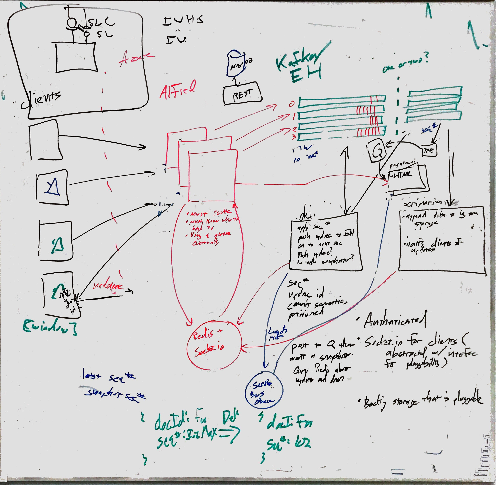

# Routerlicious

Routerlicious handles the receiving of delta operations and is responsible for the ordering and assignment of a
sequence number to them. Once assigned it is also responsible for notifying connected clients of a new sequence
number.

This repository splits the code into two separate sections. The core API is contained within src/api. This section
contains the core routerlicious code. But stubs out connections to external services behind provided interfaces.
This code is shared between clients and services.

A server implementation is contained within src/server. This makes use of the API but provides implementations of
the interfaces. For instance connections are handled with socket.io. And cross machine communication is handled
via Redis.

The server also hooks in the interval spanning tree type as the core plugin.

## Building

Building Routerlicious is done via npm scripts.

* `npm install`
* `npm run build`

## Running

Docker Compose is used to run the service locally

* `docker-compose build`
* `docker-compose up`

For development you likely want to map your source tree into the container. There's an override compose file that does
this for you. You can run it with

* `npm start` - which internally is doing a `docker-compose -f docker-compose.yml -f docker-compose.dev.yml up`

If you also need debugging you can do a

* `npm run start:debug` - which will allow you to attach a debugger

Docker will mount your source directory into the container so you need to build prior to running it.

## Design principals

* Screw the Client
* Perf === Magic

## Architecture

